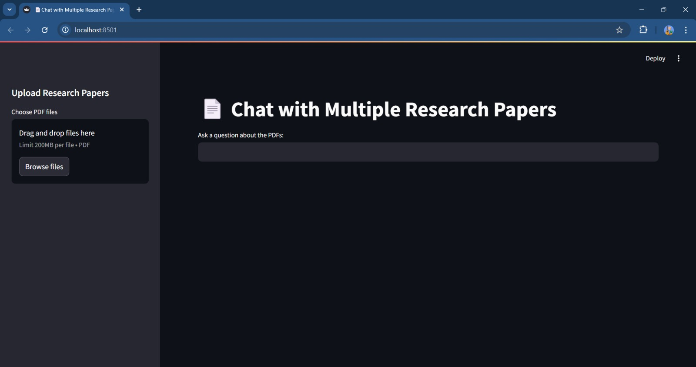

# 📄 Research Paper Summarizer & Chatbot

A powerful and user-friendly Streamlit web app that allows users to **upload multiple research papers**, **extract structured summaries**, and **ask questions directly from the PDFs** using **Google Gemini 1.5 Pro** and **LangChain**.

---
## How it Looks: 


---

## 🚀 Features

- 📁 Upload multiple research papers (PDFs)
- 🧠 Automatically extract:
  - Title, Authors, Year
  - Keywords, Methodology
  - Key Findings, Evaluation Metrics, Results
  - Preprocessing steps, Advantages, Limitations, and more
- 📊 View extracted summaries in a dynamic table
- 💬 Ask questions grounded in the uploaded documents
- ⬇️ Export the metadata summary table as CSV

---

## 💡 Motivation

Reading multiple research papers for different academic and project needs can be overwhelming. This tool was built to **automate the extraction of important insights** and enable users to interactively query their papers, saving time and boosting productivity.

---

## 🛠️ Tech Stack

- [Streamlit](https://streamlit.io/) – UI for seamless interaction
- [LangChain](https://www.langchain.com/) – LLM orchestration
- [Google Generative AI](https://ai.google.dev) (Gemini 1.5 Pro) – LLM-powered summarization and Q&A
- [PyPDF2](https://pypi.org/project/PyPDF2/) – PDF text extraction
- [dotenv](https://pypi.org/project/python-dotenv/) – Secure API key handling
- [Pandas](https://pandas.pydata.org/) – Tabular metadata display

---

## 📦 Installation

1. **Clone the repository**

```bash
git clone https://github.com/yourusername/research-paper-chatbot.git
cd research-paper-chatbot
```

2. **Install the dependencies**
```bash
pip install -r requirements.txt
```

3. **Set up your environment variables**
Create a .env file in the root directory and add your Google Generative AI API key:
```bash
GOOGLE_API_KEY=your_google_api_key_here
```

▶️ Usage
Run the app using:
```bash
streamlit run app.py
```

Upload one or more research paper PDFs via the sidebar

Automatically extract metadata and view the summaries in a table

Ask a question in the input box based on the uploaded documents
